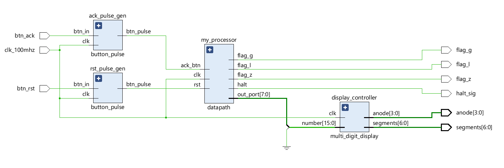
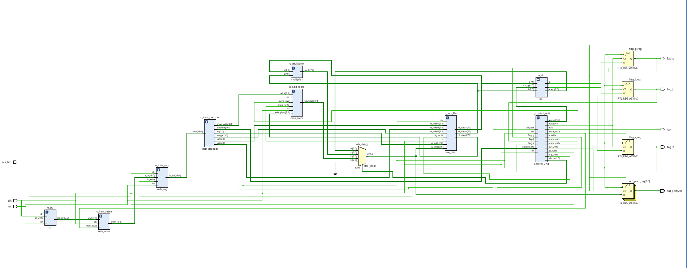
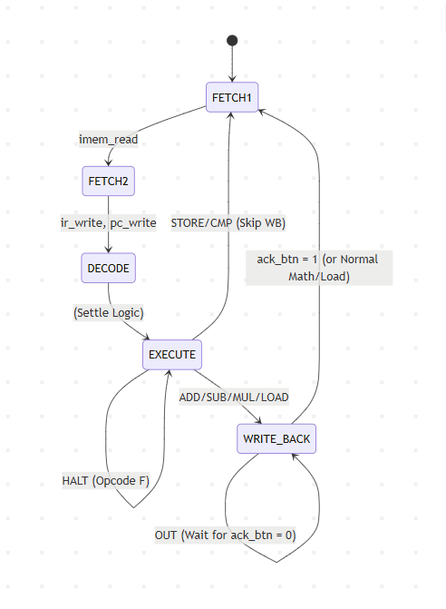

# Section 1: System Overview & Instruction Set Architecture (ISA)
## 1.1 System Overview
The Processor is a custom 8-bit, multi-cycle RISC soft-core implemented on an FPGA. It executes stored programs, handles arithmetic/logic operations, and interfaces with physical hardware peripherals (buttons, 7-segment displays).
**Architectural Highlights:**
- **Data & Instruction Width:** 8-bit internal datapath, 16-bit instruction words.
- **Memory Architecture:** Modified Harvard (isolated Instruction and Data memories).
- **Pipeline:** 5-Stage Multi-Cycle FSM (Fetch1, Fetch2, Decode, Execute, Write-Back).
- **Registers:** 8 General Purpose Registers (R0-R7).
- **Execution:** Combinational ALU (with Z, G, L flags) and a dedicated Hardware Multiplier.
- **Handshaking:** Hardware stall (`ack_btn`) for synchronized user I/O.
## 1.2 Instruction Formats
To optimize decoding, the 16-bit instruction word uses three specific layouts based on the operation:
- **R-Type (Arithmetic/Logic):** `[15:12]` Opcode | `[11:9]` Rd | `[8:6]` Rs1 | `[5:3]` Rs2 | `[2:0]` Unused
- **M-Type (Memory I/O):** `[15:12]` Opcode | `[11:9]` R_target | `[8:0]` Direct Memory Address
- **O-Type (Peripheral I/O):** `[15:12]` Opcode | `[11:9]` Unused | `[8:6]` Rs | `[5:0]` Unused
## 1.3 Instruction Set Summary

|**Hex**|**Mnemonic**|**Format**|**Description**|**Example (Hex)**|
|---|---|---|---|---|
|**`1`**|`ADD`|R-Type|Rd = Rs1 + Rs2|`1650` (ADD R3, R1, R2)|
|**`2`**|`SUB`|R-Type|Rd = Rs1 - Rs2|`2850` (SUB R4, R1, R2)|
|**`3`**|`MUL`|R-Type|Rd = Rs1 * Rs2|`3850` (MUL R4, R1, R2)|
|**`4`**|`CMP`|R-Type|Compares Rs1 and Rs2; updates Z, G, L flags.|`40E0` (CMP R0, R3, R4)|
|**`6`**|`LOAD`|M-Type|Rd = Mem[Address]|`620A` (LOAD R1, [0A])|
|**`7`**|`STORE`|M-Type|Mem[Address] = Rs|`7815` (STORE R4, [15])|
|**`8`**|`OUT`|O-Type|Routes Rs to display; stalls CPU for `ack_btn`.|`80C0` (OUT R3)|
|**`F`**|`HALT`|N/A|Permanently halts the Program Counter and FSM.|`F000` (HALT)|

---
# Section 2: Top-Level Integration & Peripherals
## 2.1 Top-Level Architecture (`top.sv`)

The `top.sv` wrapper isolates the platform-independent CPU core (`0processor.sv`) from the physical FPGA hardware. It manages clock routing, debouncing, and display multiplexing.

|**Port Name**|**Dir.**|**Width**|**Function**|**Physical Hardware**|
|---|---|---|---|---|
|`clk_in` / `rst_btn`|In|1-bit|Master 100MHz clock / Asynchronous reset.|Oscillator / Button|
|`ack_btn`|In|1-bit|Hardware acknowledgment for `OUT` instructions.|Button|
|`seg_out` / `an_out`|Out|7-bit / 4-bit|Cathode/Anode signals for display multiplexing.|7-Segment LEDs|
|`led_flags`|Out|3-bit|ALU status indicators (Greater, Less, Zero).|Discrete LEDs|
## 2.2 Peripheral Interfaces
- **Button Pulse Generator (`pulsegen.sv`):** Prevents mechanical button hold-times from racing the CPU. It detects a rising edge and translates a sustained physical press into a single, clean 1-cycle clock pulse.
- **Display Driver (`display_controller.sv` & `decoder.sv`):** Uses a high-frequency refresh counter to multiplex the anodes, splitting the CPU's 8-bit output into two Hexadecimal digits (0-F) displayed simultaneously on the 7-segment hardware.
---
# Section 3: The CPU Core (`0processor.sv`)

## 3.1 Datapath Integration
The `0processor.sv` module acts as the CPU motherboard, structurally wiring the processor's sub-modules:
- **Memory & Fetch:** `1pc.sv`, `2instr_mem.sv`, `3instr_reg.sv`
- **Control & Decode:** `4instr_decoder.sv`, `5control_unit.sv`
- **Execution & Storage:** `6reg_file.sv`, `7alu.sv`, `8multiplier.sv`, `9data_mem.sv`
## 3.2 Routing & Output Capture
- **Write-Back Mux (`wb_sel`):** A combinational traffic cop that routes data to the Register File from either the ALU (`00`), the Multiplier (`01`), or Data Memory (`10`).
- **Output/Flag Registers:** Captures internal data on the clock edge only when explicitly enabled by the Control Unit (`out_write` or `flag_write`).
---
# Section 4: The Control Unit & FSM (`5control_unit.sv`)
## 4.1 The Finite State Machine
Every instruction lifecycle is governed by a 5-stage FSM:



|**State**|**Action**|**Key Active Signals**|
|---|---|---|
|`FETCH1`|Asserts read to Program Memory.|`imem_read`|
|`FETCH2`|Latches instruction to IR, increments PC.|`ir_write`, `pc_write`|
|`DECODE`|Settles combinational decode logic.|_None_|
|`EXECUTE`|Triggers math units or memory operations.|`mem_read`, `mem_write`, `flag_write`|
|`WRITE_BACK`|Saves result to RegFile or Output Port.|`reg_write`, `out_write`|

---
# Section 5: Execution Units & Storage
## 5.1 Arithmetic Logic Unit & Multiplier
- **ALU (`7alu.sv`):** A combinational block processing 8-bit operands for `ADD` and `SUB`. During `CMP`, it performs internal subtraction to drive the `Z` (Zero), `G` (Greater), and `L` (Less) flags.
- **Multiplier (`8multiplier.sv`):** A dedicated hardware block executing single-cycle binary multiplication.
## 5.2 Memory Architecture
- **Register File (`6reg_file.sv`):** Contains eight 8-bit registers. Features three independent asynchronous read ports (Rs1, Rs2, Memory-Store) and one synchronous write port.
- **Program ROM (`2instr_mem.sv`):** 16-bit wide read-only memory holding the compiled machine code.
- **Data RAM (`9data_mem.sv`):** 8-bit wide, 512-byte addressable random access memory for long-term variable storage (`LOAD`/`STORE`).

# Section 6: FPGA Implementation

**Program - 1**
```
620A    // LOAD R1, 10    -> R1 = 5
640B    // LOAD R2, 11    -> R2 = 3
1650    // ADD R3, R1, R2 -> R3 = 5 + 3 = 8
80C0    // OUT R3         -> Press 1
2850    // SUB R4, R1, R2 -> R4 = 5 - 3 = 2
8100    // OUT R4         -> Press 2
3AD0    // MUL R5, R3, R2 -> R5 = 8 * 3 = 24
8140    // OUT R5         -> Press 3
7A14    // STORE R5, 20   
40E0    // CMP R0, R3, R4 
F000    // HALT           -> Stops the processor
```


**Program - 2**
```
620A    // LOAD R1, [0A]  -> R1 = 5
640B    // LOAD R2, [0B]  -> R2 = 3
1650    // ADD R3, R1, R2 -> R3 = 5 + 3 = 8
80C0    // OUT R3         -> [Press 1]: Verify Addition
3850    // MUL R4, R1, R2 -> R4 = 5 * 3 = 15 (0F in Hex)
8100    // OUT R4         -> [Press 2]: Verify Multiplication
7815    // STORE R4, [15] -> Mem[15] = 0F
F000    // HALT           -> Stop
```

